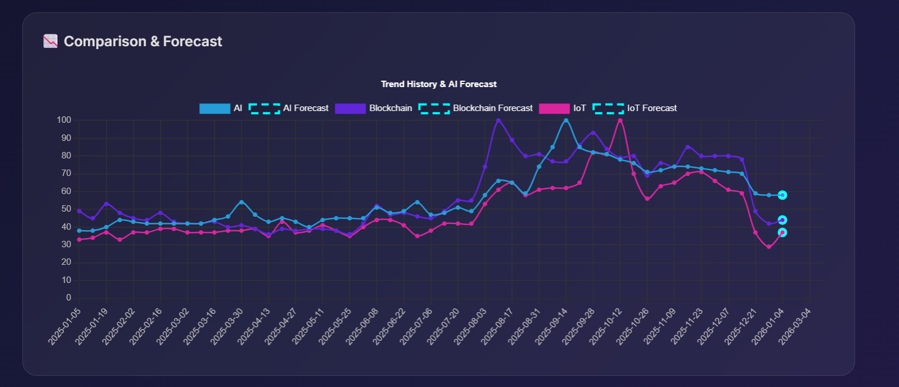

# TrendLens 📈

**AI-Powered Market Trend Analyzer**
TrendLens is a full-stack web application that helps users visualize keyword search trends, analyze sentiment using AI, and generate forecasting models.



## 🚀 Features
* **Trend Visualization:** Interactive charts for keyword search volume.
* **AI Forecasting:** Predicts future trends for the next 3 months.
* **Sentiment Analysis:** breakdown of public sentiment (Positive/Neutral/Negative).
* **Multi-Keyword Comparison:** Compare up to 5 topics simultaneously.
* **Export Reports:** Download data as CSV or full PDF reports.

---

## 🛠️ Tech Stack
* **Frontend:** React.js, Chart.js, Glassmorphism UI
* **Backend:** Python (Flask), NLTK, Pytrends
* **Deployment:** Vercel (Serverless Functions)

---

## 💻 How to Run Locally

### 1. Backend Setup (Python/Flask)
1.  Navigate to the backend folder:
    ```bash
    cd backend
    ```
2.  Create and activate a virtual environment:
    * **Windows**:
        ```bash
        python -m venv .venv
        .\.venv\Scripts\activate
        ```
    * **Mac/Linux**:
        ```bash
        python3 -m venv .venv
        source .venv/bin/activate
        ```
3.  Install dependencies:
    ```bash
    pip install -r requirements.txt
    ```
4.  Run the server:
    ```bash
    python app.py
    ```
    *The backend will run at `http://localhost:5000`*

### 2. Frontend Setup (React)
1.  Open a new terminal and navigate to the frontend folder:
    ```bash
    cd frontend
    ```
2.  Install dependencies:
    ```bash
    npm install
    ```
3.  **Configure Environment Variables:**
    Create a file named `.env` in the `frontend` folder and add this line:
    ```text
    REACT_APP_BACKEND_URL=http://localhost:5000
    ```
4.  Start the application:
    ```bash
    npm start
    ```
    *The app will open at `http://localhost:3000`*

---

## wd_ Deployment (Vercel)

This project is configured to run fully on Vercel (both frontend and backend).

### Backend Deployment
1.  Push your code to GitHub.
2.  Import the project to Vercel.
3.  Set the **Root Directory** to `backend`.
4.  Vercel will automatically detect `vercel.json` and deploy it as a Serverless Function.

### Frontend Deployment
1.  Import the **same repository** to Vercel (create a new project).
2.  Set the **Root Directory** to `frontend`.
3.  **Important:** Add the following Environment Variable in Vercel Settings:
    * `REACT_APP_BACKEND_URL`: `https://your-backend-project.vercel.app` (The URL from the step above).
4.  Deploy!

---
